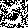
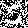

## **구성 설명**

1. **`Overview`**:
   - 이 레퍼지토리는 GAN(Generative Adversarial Networks)를 읽고, 이해하기 위해 구현한 것이다. [Read the GAN paper](https://arxiv.org/abs/1406.2661)

2. **`Features`**:
   - **train.py**:
     - 이 파일은 Gan모델을 학습시키고, 모델의 체크포인트를 저장하는것을 목적으로 한다.
     - TensorBoard를 활용해 학습 과정을 실시간으로 확인할 수 있다.

   - **test.py**:
     - 이 파일은 학습된 Gan 모델의 체크포인트를 불러와 n개의 생성 이미지를 만드는 것을 목적으로 한다.
     - `output_path` 에 n개의 이미지가 .png 형식으로 저장된다.

3. **`File Structure`**:
   - 프로젝트의 전체적인 파일 구조
  ```
  ├── test.py
  ├── train.py
  ├── models/
          ├── gan.py
          ├── gen_dis.py
  ├── data/
          ├── datasets.py
  ├── outputs/
          ├── 4.png
          ├── 3.png
          ├── 2.png
          ├── 1.png
          ├── 0.png
  ├── runs/
      ├── tensorBoard.logging
  ```

4. **`How to Use`**:

---

### 사용한 라이브러리
- **torch**: PyTorch 딥러닝 라이브러리.
- **torchvision**: PyTorch에 포함된 데이터셋 및 이미지 변환 유틸리티.
- **matplotlib**: 학습 진행 및 결과를 시각화.
- **tensorboard**: 학습 과정 모니터링 및 결과 시각화.

---

### `train.py` 사용법

#### **기능**
`train.py`는 GAN 모델을 학습시키는 스크립트입니다. 주요 인자를 설정하여 학습 환경을 구성할 수 있습니다.

모든 파라메터는 기본값이 설정되어있어, 그냥 실행하여도 동작합니다.

#### **주요 인자 설명**
- `--epochs`: 학습 에포크 수 (기본값: 50).
- `--device`: 사용할 디바이스 (기본값: cpu).
- `--learning_rate`: 학습률 (기본값: 0.0001).
- `--tensorboard_path`: TensorBoard 로그파일 저장할 폴더 (기본값: experiment_01).
- `--model_path`: 모델 체크포인트 저장 폴더 (기본값: checkpoints).

#### **사용 예시**
1. 기본 설정으로 학습:
   ```bash
   python train.py

 - 실행하면 `output_path`에 체크포인트가 1에포크별로 저장되고, `tensorboard_path`에 loss, 예측값 이미지가 저장된다.
---

### `test.py` 사용법

#### **기능**
`train.py`는 GAN 모델을 학습시키는 스크립트입니다. 주요 인자를 설정하여 학습 환경을 구성할 수 있습니다.

#### **인자 설명**
- `--device`: 사용할 디바이스 (기본값: cpu).
- `--number_test`: 생성할 이미지 수 (기본값: 5).
- `--model_path`: 사용할 모델 체크포인트 (기본값: checkpoints/epoch_32.pth).
- `--output_path`: 출력값을 저장할 폴더 (기본값: outputs).

#### **사용 예시**
1. 기본 설정으로 학습:
   ```bash
   python test.py
 - 실행하면 `model_path`의 체크포인트를 불러와 `output_path`에 순서대로 저장한다.
---

5. **`Results`**:
   - 생성된 이미지 샘플

<div style="display: flex; justify-content: space-around;">
    
    
</div>


- For more generated samples, visit the `outputs/` directory.

---

6. **`Reference`**:
   - Generative Adversarial Networks
   - Maxout Networks

---

